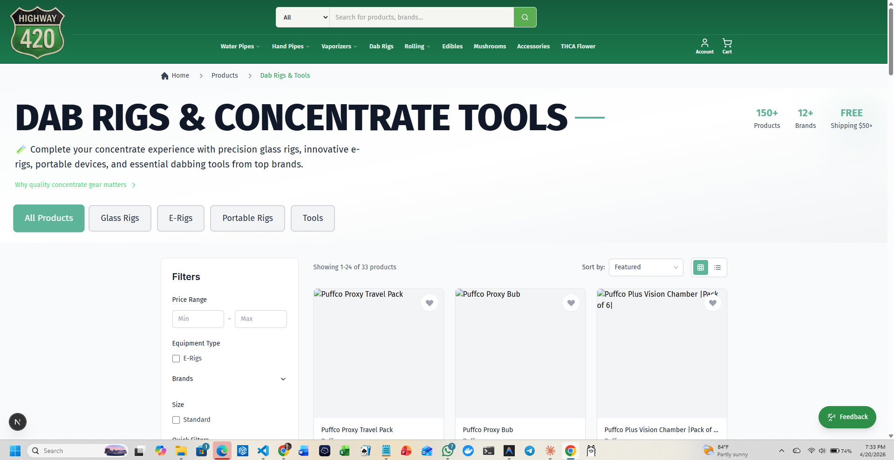

# Highway 420 Product Variations – Audit V1

_Last updated: 2025-11-17_

## 1. Purpose

This document maps how **product variations** (sizes, flavors, strengths, colors, packs, etc.) are currently represented across:

- Database schema (Supabase / Postgres)
- API and import pipelines
- Front-end React/Next pages and components

…so we can design a **single, coherent variation model** that:

- Works for all major verticals (glass, vapes, THCA, mushrooms, kratom, gift cards, etc.)
- Integrates cleanly with **search, autosuggest, and filters**
- Preserves existing behavior (“never break userspace”) while enabling a gradual migration.

---

## 2. Schema-Level Variation Hooks

### 2.1 `main_site_products` (Primary Surface)

Defined in:

- `supabase_migration_001.sql`
- `enhanced_main_site_products_schema.sql`

Relevant fields:

```sql
-- PRODUCT VARIATIONS - Support for different sizes, flavors, etc.
variations JSONB DEFAULT '[]'::jsonb, -- Array of variation objects
parent_product_id UUID REFERENCES main_site_products(id), -- For variation relationships
```

Observations:

- The schema **anticipates** a structured variation model through:
  - `variations JSONB` – free-form array of variation objects per product
  - `parent_product_id` – allows representing variations as separate rows linked to a parent
- There is **no dedicated `product_variations` table** currently active in migrations (even though
  `DATABASE_RESTRUCTURE_TASK_MANAGEMENT.md` mentions one as a planned step).
- No triggers or functions currently maintain invariants on `variations` or `parent_product_id`.

Implication: variations are available as an **extension point**, but not yet standardized or enforced at the DB level.

---

## 3. Legacy / Transitional Surfaces

### 3.1 Legacy `products` table & enhanced functions

`enhanced_products_schema.sql` defines functions against the older `products` table (`search_products_enhanced`, `update_inventory_enhanced`, `calculate_display_price`) and views (`enhanced_products_view`, `compliance_products_view`).

- These **do not** define a dedicated variations table either.
- Variations in the legacy world likely lived in CSVs and WooCommerce-style attributes, now partially collapsed into single rows.

Conclusion: there is **no fully normalized variation schema** live today; all variation logic is implicitly modeled in product-level fields and page-specific types.

---

## 4. Front-End Variation Patterns (By Vertical)

The React/Next codebase currently treats many variation concepts as **per-vertical filters**, not unified domain objects.

### 4.1 THCA Flower / PNV / Master Collections

Files:

- `app/thca_flower/ThcaFlowerPageContent.tsx`
- `app/thca_flower/components/ThcaFlowerFilters.tsx`
- `app/thca_pnv/ThcaPnvPageContent.tsx`
- `app/thca_pnv/components/ThcaPnvFilters.tsx`
- `app/thca-master/ThcaMasterPageContent.tsx`

Patterns:

- Product TypeScript shapes include optional fields like:

  ```ts
  size?: string;        // e.g., '3.5g', '7g', '14g', '28g'
  style?: string;       // e.g., infused preroll styles
  type?: string;        // e.g., 'Preroll', 'Cartridge', 'Disposable'
  material?: string;
  ```

- Filters operate on **simple string arrays**:

  ```ts
  sizes: string[];
  styles: string[];
  types: string[];
  categories: string[];
  ```

- Filter UIs derive unique values from in-memory product lists (e.g., `new Set(products.map(p => p.size))`).

Key point: THCA variations such as **size (grams), type (flower vs preroll), style**, etc., are modelled as **flat string attributes on the product**, not as separate variation entities.

### 4.2 Pipes / Bongs / Bubblers / Dabs & Tools

Files (examples):

- `app/pipes/PipesPageContent.tsx`
- `app/pipes/components/PipesFilters.tsx`
- `app/pipes/components/ActiveFilters.tsx`
- `app/pipes/components/PipesProductGrid.tsx`
- `app/bongs/BongsPageContent.tsx`
- `app/bongs/components/BongsFilters.tsx`
- `app/bubblers/BubblersPageContent.tsx`
- `app/bubblers/components/BubblersFilters.tsx`
- `app/dabsntools/DabsntoolsPageContent.tsx`
- `app/dabsntools/components/DabsntoolsFilters.tsx`

Patterns:

- Pipes:
  - Product interfaces include e.g.:

    ```ts
    size?: string;   // 'Small (3-4")', 'Medium (4-6")', 'Large (6-8")', 'XL (8"+)'
    style?: string;  // 'Spoon Pipe', 'Chillum', 'Sherlock', etc.
    inStock?: boolean;
    ```

  - `PipesFilters` uses `uniqueSizes` and `uniqueStyles` derived from products.
  - `PipesProductGrid` displays `product.size` as a badge.

- Bongs/Bubblers:
  - Attributes like `height`, `joint_size`, `percolator` are used for filtering.
  - Example:

    ```ts
    joint_size?: string;
    percolator?: string;
    ```

  - Filters define arrays such as `jointSizes: string[]`, `percolators: string[]`.

- Dabs & Tools:
  - `DabsntoolsPageContent` & filters treat:

    ```ts
    type?: string;  // 'Glass Rig', 'E-Rig', 'Portable', 'Tools'
    size?: string;  // Standardized size string
    material?: string;
    ```

Again, these are **single-level attributes** on each product, not canonical variation entries with their own inventory & pricing.

### 4.3 Mushrooms

Files:

- `app/mushrooms/MushroomsPageContent.tsx`
- `app/mushrooms/components/MushroomsProductGrid.tsx`
- `app/mushrooms/components/MushroomsFilters.tsx`
- `app/mushrooms/components/ActiveFilters.tsx`

Patterns:

- Product shape includes fields like:

  ```ts
  size?: string;
  strength?: string;    // e.g., microdose, standard, mega
  form?: string;        // e.g., capsule, chocolate
  type?: string;        // edible, caps, etc.
  desired_effect?: string[];
  ```

- Filters track:

  ```ts
  strengths: string[];
  forms: string[];
  desiredEffects: string[];
  origins: string[];
  ```

- UI shows `Strength: {product.strength}` and `Form: {product.form}` as simple labels.

### 4.4 Generic Product UI & Variants via Images

Key components:

- `app/components/UniversalProductCard.tsx`
- `app/components/ProductGallery.tsx`
- `app/components/VariantSelector.tsx`
- `app/components/RecentlyViewedProducts.tsx`

Patterns:

- `UniversalProductCard` supports **multiple images as variant proxies**:

  ```ts
  interface UniversalProduct {
    image_url?: string;
    image_urls?: string[]; // Added for variant support
    // ...
  }

  const imageUrls = product.image_urls || [];
  const selectedImageUrl = imageUrls[selectedImageIndex] || primaryImageUrl;
  ```

- `ProductGallery` treats `image_urls` as “color variations”:

  ```ts
  // Gallery images showing color variations
  image_urls?: string[];

  // Variant support - NEW
  onVariantChange?: (variantIndex: number, imageUrl: string) => void;
  selectedVariant?: number;
  ```

- `VariantSelector` infers **color variants** from filenames / URLs and builds `VariantOption[]` purely on the client, with no schema integration:
  - Color detection via `extractColorFromFilename(url)`.
  - `hasProductVariants(image_urls)` is just `image_urls.length > 1`.

> Net effect: **visual variants** are inferred from multiple images; there is no DB-backed variation entity, and inventory/pricing per variant are not modeled yet.

---

## 5. Variation Representation in Imports & CSVs

`inventory_staging.csv` (and related import scripts) contain rows with WooCommerce-like **variable product + variation** semantics:

- Parent rows with `variable` product types.
- Child rows with `variation` type and attributes such as:
  - `Color`, `Flavor`, etc. stored in attribute columns.
- Examples in CSV:
  - `Packwoods Packspod` with multiple flavors as variations.
  - `XSIR LED Screen Discreet Battery` with color variations.

Currently, these are likely mapped into **flat `main_site_products` rows**, losing explicit “variation” structure during import, or at best being partially encoded into `name`, `tags`, or `search_keywords`.

This is a key opportunity for improvement: we already have the variation intent in CSVs, but not yet normalized in Supabase.

---

## 6. How Variations Interact with Search (Today)

From `SEARCH_AUDIT.md` and the code review:

- Search surfaces (`/api/search`, `/products`, THCA endpoints) operate at the **product row level** (mainly `main_site_products`).
- Variation-related fields (size, strength, form, type, style) are **not systematically mapped** into:
  - `search_keywords` (JSONB text array)
  - FTS text index (beyond whatever happens to be in `name` / `description`)
  - Autosuggest signals
  - Faceted filters backed by DB (most filters are client-side derived sets)
- THCA vector search (`thca_vector_search`) filters on brand/category/price/stock but does not know anything about size/strength variations beyond whatever is in plain text.

Result:

- Users can filter by variation-like attributes **on specific pages** (pipes, THCA, mushrooms, etc.).
- Search relevance and autosuggest are primarily driven by **parent product text**, not by structured variation attributes.

---

## 7. Core Problems / Gaps

1. **No canonical variation entity**
   - Everything is ad-hoc: per-page `size`/`strength`/`type` strings, CSV attributes, and client-only image-derived variants.

2. **No direct inventory & pricing per variation**
   - Stock management is per `main_site_products` row; multi-size or multi-flavor SKUs are not modeled as separate inventory units.

3. **Search is not variation-aware**
   - A user searching for “watermelon bubblegum” or “1g preroll” relies on incidental text in `name`/`description`, not a structured mapping of variations to searchable keywords.

4. **Fragmented filter semantics**
   - Each vertical hard-codes its own size/strength/format taxonomy, with no shared variation schema across the site.

---

## 8. Design Directions (High-Level)

These are **design ideas**, not yet implemented.

### 8.1 Canonical Variation Model

Introduce a **single variation model** that can be represented either as:

1. **Dedicated `product_variations` table** (recommended long-term)
   - Columns (initial sketch):
     - `id UUID PK`
     - `product_id UUID FK → main_site_products(id)` (parent)
     - `sku TEXT UNIQUE`
     - `name TEXT` (e.g., flavor/size variant label)
     - `attributes JSONB` (e.g., `{ size: '3.5g', flavor: 'Watermelon Bubblegum', strength: 'Mega' }`)
     - `price DECIMAL(10,2)` (optional override)
     - `stock_quantity INT`
     - `is_active BOOLEAN`
   - Allows per-variant inventory, price, and search keywords.

2. **Standardized `variations` JSONB schema** (short-term compatible path)
   - Keep using `main_site_products.variations`, but enforce a schema such as:

     ```json
     [
       {
         "sku": "PACKWOODS-WATERMELON-BUBBLEGUM",
         "label": "Watermelon Bubblegum",
         "attributes": {
           "flavor": "Watermelon Bubblegum",
           "size": "5ct",
           "strength": "Standard"
         },
         "price": 39.99,
         "stock_quantity": 20,
         "image_url": "..."
       }
     ]
     ```

   - Still enables search/indexing by flattening attributes → `search_keywords` & FTS vectors.

A phased approach can begin with **JSONB-only** and later lift into a table without breaking consumers.

### 8.2 Variation-Aware Search & Filters

Once we have a canonical variation model, we can:

- Flatten variation attribute strings into:
  - `main_site_products.search_keywords`
  - Autosuggest results (e.g., show flavor/strength suggestions)
- Add server-side filters for common dimensions:
  - `sizes`, `flavors`, `strengths`, `forms`, `pack_count`, etc.
- For THCA vector search:
  - Include variation attributes when building the text that gets embedded.

### 8.3 UI/Component Integration

Existing UI pieces that should align with the canonical model:

- `VariantSelector` + `ProductGallery` + `UniversalProductCard`
  - Today: use `image_urls` only.
  - Future: use **variation objects** (with name, attributes, inventory) as the primary source and images as a property.

- Category pages (pipes, bongs, THCA, mushrooms, dabs)
  - Today: local `size`/`strength`/`type` strings per page.
  - Future: derive these from **variation attributes** (and/or aggregated product-level attributes computed on the server).

---

## 9. Recommended Next Steps

1. **Decide canonical representation:**
   - Short term: standardize `main_site_products.variations` JSONB schema for a few pilot verticals (e.g., **disposables flavors**, **mushroom strengths**, **THCA sizes**).
   - Medium term: introduce `product_variations` table matching that schema.

2. **Map CSV attributes → `variations` JSONB** during import:
   - For a small subset of SKUs, prove out the mapping (e.g., Packwoods disposables, XSIR batteries).

3. **Expose variation attributes in search & autosuggest:**
   - Add a server-side transformation that flattens variation attributes into `search_keywords`.
   - Update `/api/search` and autosuggest to be aware of variation dimensions where relevant.

4. **Align UI components:**
   - Update `VariantSelector` and `UniversalProductCard` to optionally accept **structured variation data** (in addition to plain `image_urls`), so the UI doesn’t have to guess from filenames.

5. **Define a variation decision tree (to be drafted next):**
   - For a given product category, decide:
     - Is this single-SKU (no variations) or multi-variation?
     - If multi-variation, which dimensions are primary? (size, flavor, strength, color, pack size, etc.)
     - How should those dimensions appear in search facets?

The next iteration of this document will include a **concrete variation decision tree** and specific schema proposals for the JSONB and/or table-based model.
